# TL;DR
뭔가 짧게 지나갔기에 별로 한게 없겠지 생각했는데 나열하고 보니 나름 열심히 했다는 생각이 들만큼 뿌듯했고 올해도 과거의 나를 본받으면서 열심히 달려봐야겠다
- 저번학기 22학점 수강으로 나에게 한학기동안 수고했다는 3주간의 제주도 워케이션
- 올해는 졸업을 위해 판데믹으로 인한 비대면 수업을 활용하여 막판 스퍼트로 학점을 몰아서 수강
- 재밌었지만 아쉬웠던 스토어링크와의 이별과 카카오스타일에서의 새출발!
- 나를 발전시킬 수 있는 여러 스터디 활동들...
- 네이버 부스트 캠프 웹·모바일, 백엔드 리뷰어 활동
- 혼자 기록해놓지만 말고 재대로 된 블로그를 해보자

# 22학점 연속 수강
사실 코로나 타이밍일 때 최대한 많이 학점을 들어야 학업에 얽매이지 않고 내가 하고싶은 것들을 할 수 있을것이라고 생각했고, 결국 졸업까지 성공했다!

## 21년도 2학기 22학점 수강에 대한 보상, 제주도 워케이션
2022년도에는 비대면 여부가 불확실한 상황에서 평점 3.75 이상의 추가학점이 반드시 필요했습니다.

작년 3학년 2학기에 22학점을 무려 4.07의 학점을 받으면서 이번 학기에도 추가학점을 신청할 수 있었고 작년 열심히 살아왔다는 보상으로 제주도를 가기로 결심했다.
> 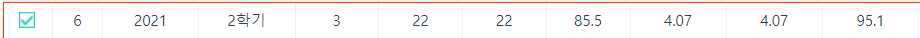

당시 항공권
> 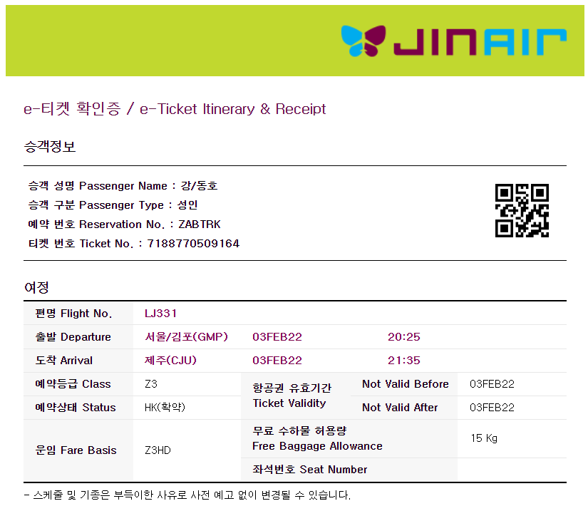
> 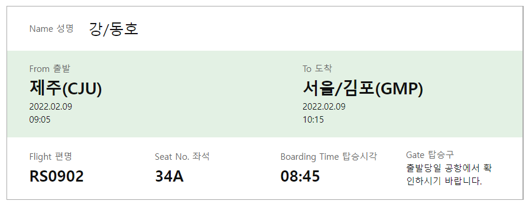

회사 워케이션이다 보니 추가적으로 개발팀 멤버분들과도 함께 보낼 수 있었는데 같이 일하기도 하고 맛있는것도 먹으러 가고 나름 매일매일이 힐링되는 나날을 보낼 수 있었다.

## 2021년 4학년 1학기
이번 학기까지는 비대면을 최대한 활용해봐야겠다는 생각으로 22학점을 신청을 하게 되었다. ~~직전학기에도 했으니 할 수 있을거라는 안일한 생각...~~

이 외에도 추가적인 학점을 위해 자료구조 수업의 학부조교활동을 신청하게 되었는데, 비대면으로 학우분들의 질문사항을 답변해주면 되는 내용이라 자료구조를 다시 한번 되짚어 가는 상황이라 도움도 되었고 어떤 부분에서 막히는지 같이 고민할 수 있었다.

> 그래서 4학년 1학기는 총 26학점을 수강한 것과 동일하다 (대견해 👍)

특히, 졸업을 위해서는 필수적으로 수강해야 했던 캡스톤 프로젝트는 재직중인 스토어링크라는 회사에서 산학 프로젝트로 진행했었다.
팀원과 함께 집중을 할 수 있는 시간이 필요했는데, 사내 워케이션 제도를 활용하여 ~~또다시~~제주도에 머물면서 2주동안 작업을 진행했고 API Rail이라는 시각화 서비스를 완성할 수 있었습니다.

학업과 업무를 위해 매일을 2시간 ~ 4시간 정도만 취침했지만 재택근무와 비대면 수업을 활용해서 만든 시간 덕분에 가까스로 마무리할 수 있던게 아닐까 생각됩니다. ~~재택근무 사랑합니다~~

이번 학기에 들어두지 못하면 4학년 2학기에는 직접 통학까지 해야된다라는 더 힘든 난관이 기다리고 있었기에 높은 학점은 아니였지만 준수하게 3.5 학점으로 마감할 수 있었다.
> 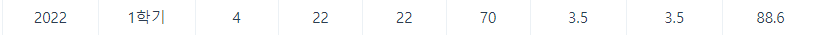

# 나를 발전시키기
2022년도에는 여러 개발 스터디도 진행하였고 영어 과외를 받기도 하면서 더 좋은 개발자가 되기 위해 나아가보려고 합니다.

부끄러운 나머지 스터디 정리를 노션으로만 작성했었는데 아래 스터디 정리들도 블로그로 옮겨서 공유해볼 예정입니다 ㅎㅎ
## 쿠버네티스 스터디
사실 이 스터디를 통해 내가 스스로 새로운 기술에 대해 공부할 수 있는 베이스인 만큼 이때 뵜던 스터디장분과 지금까지도 카프카 스터디를 이어오고 있습니다.

사실 배포를 진행할 때 최근에는 도커 이미지를 그대로 배포하는 상황이 많았고 실제로 사내에서도 도커를 통해 배포하는 상황도 많았는데 단순하게 Docker 정도만 이미지를 띄워서 올리는 수준 정도만 하다가 최근에는 도커 설정부터 정확하게 잡고 갈 수 있게 되었고 당시에는 쿠버네티스를 실무에서 사용하진 않았지만 스케일업이나 스토리지를 공유하는 과정에 대해 이해를 하고 넘어갈 수 있었습니다.

> 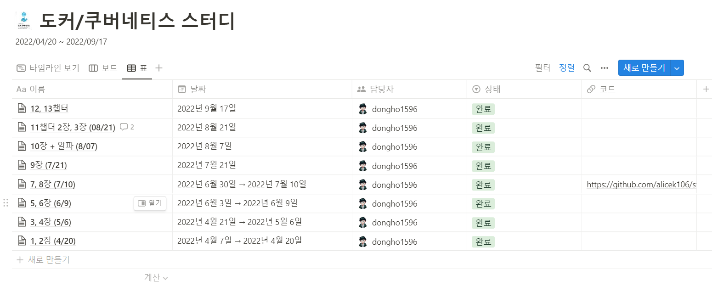

## 카프카 스터디
개발자는 스스로 공부해야 한다는 습관의 일환으로 계속해서 배워가는 중이고 위의 쿠버네티스 스터디를 이어온 분과 함께 이어오고 있습니다.

지난번엔 스터디를 그분이 모집해주셔서 이번엔 제가 모집했었고 다행히 지금까지도 진행해오고 있습니다.

2주마다 범위를 정하고 정리해오고 궁금하거나 이해가지 않는 부분에 토론하는 방식으로 진행하고 있는 만큼 실제 카프카를 적용했을 떄의 상황을 기준으로 이해해나가고 있습니다.

실무에서도 카프카를 사용하고 있다 보니 배워가면서 적용하고 싶은 부분에 대해 초점을 맞춰 더 흥미를 갖고 학습해 나가고 있습니다.

> 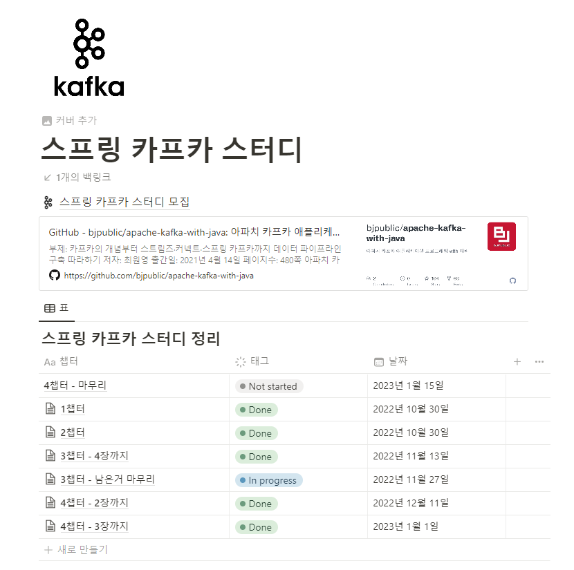

## 코글리즘
코틀린 알고리즘 스터디, 사실 스프링을 자바로만 쓰다가 코틀린을 사용하기 시작하면서 이미 존재하는 함수들이 있는지 모르고 만들어 쓰는 경우가 많았는데, 스터디 시작전부터 코틀린 공식문서를 한번 읽고 스터디를 시작했던 부분이 크게 도움이 되었습니다.
(재원님 감사합니다 👍)

매주 풀어야 하는 문제의 주제를 정하고 각각 개개인이 문제를 하나씩 정해서 모두가 풀어온 뒤 주말마다 코드리뷰를 진행했습니다.

서로의 로직적인 측면과 코틀린적 활용법을 빠르게 습득할 수 있는 계기가 되었던 것 같고 이전엔 자바는 코테 풀때마다 타입을 지정해야 되다보니 자바스크립트 위주로 푸는 경향도 있었는데 완전히 코틀린으로 풀 수 있는 습관을 만들 수 있었습니다.

이후에 2기 활동도 진행했었는데 2기는 알고리즘 풀기 보다는, 제가 부족하다고 생각하고 있는 코드리뷰를 진행했습니다.
> 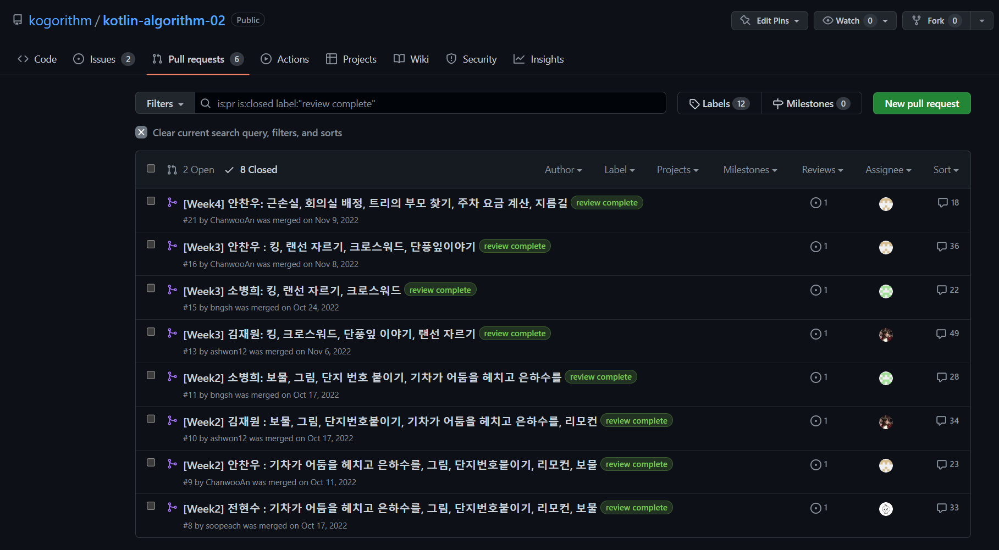

처음에는 문제를 이해하는 것 만으로도 벅찼습니다. 하지만 오로지 코테 공부할 때와는 다르게 그냥 로직이 통과되는 방법 하나만 알고 넘어가지 않고 다양한 코드를 보고 비교할 수 있던 점이 오히려 알고리즘 공부에는 더 도움이 되었던 것 같습니다.

## 영어 과외 & 헬스장 PT
오로지 개발만 키운다가 아닌 개발에 도움이 되는 것들도 조금씩은 채워가보자는 생각으로 영어 회화 과외와 좀더 오래 생존하기 위해 헬스장에 PT를 추가적으로 등록해서 다니고 있습니다.

올해 여러가지 핑게로 헬스를 많이 나가지는 못했지만, 하고싶은 목표를 이루기 위해서는 그만큼의 체력이 반드시 받쳐줘야 한다고 생각하기에... 올해는 주 3회는 헬스장 가보겠다는 목표를 세워보려고 한다.

# End of [StoreLink](https://storelink.io/)
> 내 백엔드 개발의 시작이자 발전을 이룰 수 있었던 곳

퍼그샵, 유짓, 스토어링크, 프라이데이, 애드링크...

위 이름들은 내가 이 곳에서 약 1년 반정도 근무하면서 내가 만들었던 프로젝트 입니다. 프로젝트들에 대한 애정과 함께 그동안 함께했던 동료들을 내려두기는 어려웠습니다.

당시의 스토어링크는 저에게 필연적인 회사였습니다.

주 35시간 근무제와 전사 원격근무를 지원하고 있었습니다. 저는 학업과 병행하고 있는 상황이다 보니 이 사내 복지를 최대한 활용하여 새로운 기술 공부나 프로젝트 시간으로 활용할 수 있게 도와준 회사였습니다.

## R&D 엔지니어
이곳에서 프리랜서로 퍼그샵 백엔드 개발을 메인으로 진행하면서 초기에는 사내에서 운영중인 서비스의 백엔드 유지보수를 진행했습니다.

하지만 가끔은 안드로이드 앱의 유지보수를 진행해야 했을때도 있었고, 프론트엔드 작업도 있는 만큼 저를 백엔드 포지션이나 프론트엔드 포지션으로 제한하는 것 보다는 스타트업에 맞게 새로운 포지션을 만들어가보자고 생각하게 되었습니다.

모바일, 프론트엔드 그리고 백엔드까지 작업하면서 A/B 테스트를 가장 먼저 진행할 수 있었고 직접 서비스의 방향성을 정할 수 있는 만큼, CTO께 말씀드려 개발팀 하위의 R&D 파트로 업무를 진행할 수 있었습니다.

프라이데이나 M-자비스 그리고 애드링크라는 새로운 프로젝트를 진행할 수 있었고 적용하고 싶었던 기술을 가장 먼저 적용해보거나 사내 공통모듈을 만드는 개발자로서 성장의 발판이 되었습니다.

## 더 성장해보자
개발자로서의 나를 더욱 성장시켜야하는 타이밍을 놓치고 싶지는 않았습니다.

사실 다니면서도 매번 스스로 개발 스터디를 참여하고 새로운 기술이 있으면 프로젝트에 적용해보는 활동을 진행하면서 스스로 채워갈 수 있는 부분이 있다면 채워가고자 노력했습니다.

실제로 Kotlin을 가장 먼저 도입하기도 했고 WebFlux를 적용한 프라이데이 서비스를 만들면서 시행착오도 있었지만 만들어야 했던 기술 스택이 정해진 이후 적용하는데에 문제가 없다라는 확신이 섰을 때, 개인시간을 좀 더 할애하더라도 프로젝트의 완성도를 높일 수 있었습니다.

하지만, 각 서비스를 개인 단위로 만들어야 했었고 그러다 보니 업무를 진행하는데 있어서 더 효율적인 방향성에 대한 제시나 코드리뷰, 그리고 대용량 사용자 층에 대한 욕구 들은 채워나갈 수 없다는 생각이 들었고 고민 끝에 이직을 결심하게 되었습니다.

# 카카오스타일에서의 시작

우여곡절 끝에 운좋게 합류한 카카오스타일에 합류하게 되었다. 백엔드 개발자로서는 아직도 부족하지만 주변 동료들에게 민폐가 되지 않을 정도로 성장해보려고 합니다.

입사 당시에서는 PIM(상품정보관리)시스템 팀이였지만 팀의 중요한 포지션을 강화하기 위해서 프라이싱시스템팀으로 바뀌었다!

프라이싱팀 내에서 채용도 진행하고 있는데 혹시라도 저희 팀에 관심있으면 지원해보시면 좋을것 같아요 😀
- [백엔드 개발자](https://career.kakaostyle.com/o/31935)
- [PO](https://career.kakaostyle.com/o/59563)

## 채용 프로세스
사실 일반적인 개발 회사 지원 프로세스랑 크게 다르지 않았지만 서류 제출 당시에는 이력서 양식이나 지원 동기 부분이 크게 필요하지 않았던게 기억에 남는다

그 이후에는 코테가 아닌 과제테스트를 전달받았고 웹 서비스를 만드는 프로젝트 두가지 주제가 있었고 하나를 선택해서 제출하면 되었었다.

사실 개발자는 대다수가 알고리즘 코딩테스트 보다는 과제를 풀면서 서비스를 만들어가는 과정을 더 선호할 것이다. 알고리즘은 코드로 수학문제를 푸는것이랑 다를게 없다고 생각되었는데, 과제를 진행하면서 학업과 업무로 인해 시간이 부족했지만 덕분에 재미있게 완성해 나갈 수 있었다.

그 이후에는 1차 면접이였고 기술은 기본적인 것 위주로 물어보셨고 과제는 크게 물어보지 않으셔서 의아했었다.

다만 더 중요한건 같이 일할 팀원으로서 함께할 수 있는지를 알아가는 과정이였고 경험한 것에 빗대어 잘 말할 수 있었습니다.

이떄 아직도 기억에 남는게 채용 공고에 상품팀도 있고 상품정보시스템팀도 있던데 어떤 차이고 왜 팀이 나눠져 있었는지에 대한 질문이였다. 이부분은 팀명이 변화하면서 더이상의 면접자들은 물어보지 않겠지 하고 생각이 든다 🤣

최종적 면접은 내가 있는 팀의 최상위 그룹장분께서 들어오셨고 면접 자체가 나를 파악해가는 과정보다는 함께 일할때 어떤 생각을 하고 있는지를 들어봤던 것 같다.

그러면서 HR담당자분께서도 분위기를 편하게 말씀주셨던 부분이 자연스럽게 내 생각을 이야기할 수 있던 것 같아서 소신있게 말씀드릴 수 있었습니다.

면접이 끝나고 5분 내로 면접 결과를 받아볼 수 있었고 최종적으로 4학년 1학기가 마치는 시점에 합류하기로 결정했습니다.

합격 이후로도, 두달가량이 되는 일정임에도 불구하고 이해해주신 팀과 인사담당자분께 다시한번 감사합니다.

## 온보딩
첫날 온보딩은 사원증이나 장비 지급 건으로 오프라인에서 필수적으로 진행했었고 방대한 프로세스가 하루안에 압축되어 진행되었다.

처음에는 어떤게 뭐지 하고 자주 생각했었는데, 이 하루 온보딩이 끝나더라도 물어볼 수 있는 서포터즈가 있고 PX팀에서 만들어주신 온보딩 채널까지 있어서 적응하는데 큰 무리가 없었습니다. (같은팀 동료이자 서포터즈였던 토니 너무너무 고마워요 🙇)

## 개발 문화 및 스터디
팀 내에서 사용하고 있는 언어와 프레임워크는 Kotlin과 Spring Boot 이고 최소 팀원 2명의 리뷰가 Approve 되었을 때 머지를 진행할 수 있습니다.

이 과정에서 내가 작성한 코드가 로직적으로 맞지 않는 부분도 먼저 검증할 수 있고 더 좋은 로직을 생각해낼 수 있어서 리뷰주시는 팀원분들께 항상 감사해하고 있습니다.

이 외에도 매주 목요일마다 개발 관련 논의와 스터디 내용 공유를 진행하고 있는데, 먼저 개발 하던 과정에서 막힌 부분을 어떻게 해결하는게 좋을지 고민하는 자리나 좋은 기술 관련 정보를 소개할 수 있는 자리이다.

처음에는 온보딩 과정도 있고 따라가기도 벅차다고 생각했는데 개발 과정에서 필연적으로 부딪히는 부분을 많이 해결할 수 있어서 팀 내의 좋은 문화중에 하나라고 생각합니다.

그리고 다른 하나인 스터디 정리인데, 미리 강의를 듣고 중요한 내용에 대해 정리해 서 팀끼리 공유할 수 있는 부분이다. 초반에는 조금 정리하다가 강의만 우선적으로 듣기만 하고 정리를 못하고 있는데 ... 이부분도 올해에는 개선해야 할 부분중에 하나이다 ㅠ

# 부스트 캠프 웹·모바일 7기 백엔드 리뷰어
팀 내에서 리뷰를 진행하다가 전체적인 로직을 이해하려면 어떻게 해야될까 지속적으로 고민했습니다.

그러던 도중 네이버 부스트캠프의 백엔드 리뷰어를 모집한다는 글을 보았고 완전 노베이스 프로젝트를 리뷰하면서 최대한 로직을 이해해보는 연습을 하면 코드리뷰의 퀄리티나 속도가 개선되지 않을까 생각했습니다.

부스트캠프를 처음 알게된 것은 존경하는 고등학교 선배님 중에 정성민님의 이력서를 읽으면서 리뷰어와 멘토활동에 관한 기록을 보면서 알게 되었던 만큼, 신뢰가 생겼고 바로 지원버튼을 클릭하여 지원서를 작성했습니다.

하지만 새로 접하는 코드에 대한 리뷰를 하려면 전체적인 흐름 정리를 이해하고 이해한 내용의 로직이 개선될 지점과 로직적인 이슈를 파악하는 것이 중요했습니다. 

그리고 개선할 수 있는 부분에 대해서 내가 알고있는 방법 보다는 더 좋은 개선방안에 대해서 생각해 보라는 리뷰를 달면서 저도 리뷰어분들께 이렇게 해결하면 더 좋겠구나 하는 부분들도 배워갈 수 있었습니다.

이번엔 오로지 리뷰어로만 활동했고 대단하신 분들도 많이 뵐 수 있었던 만큼 올해에도 리뷰어나 멘토까지 활동해볼 수 있는 기회가 된다면 좋을것 같습니다!

## 부스트캠프 굿즈들
사실 리뷰어 활동이 끝나고 시간이 꽤 지난 뒤였어서 기억하지 못하고 있었는데... 택배를 열어보니 써프라이즈 ~ 😲
- 부스트캠프 로고가 박힌 기모 맨투맨 (해커톤 가서 입어봐야지 ㅎㅎ)
- 담요
- 2023년도 캘린더
- 부스트캠프 뱃지
- 감사 편지
> 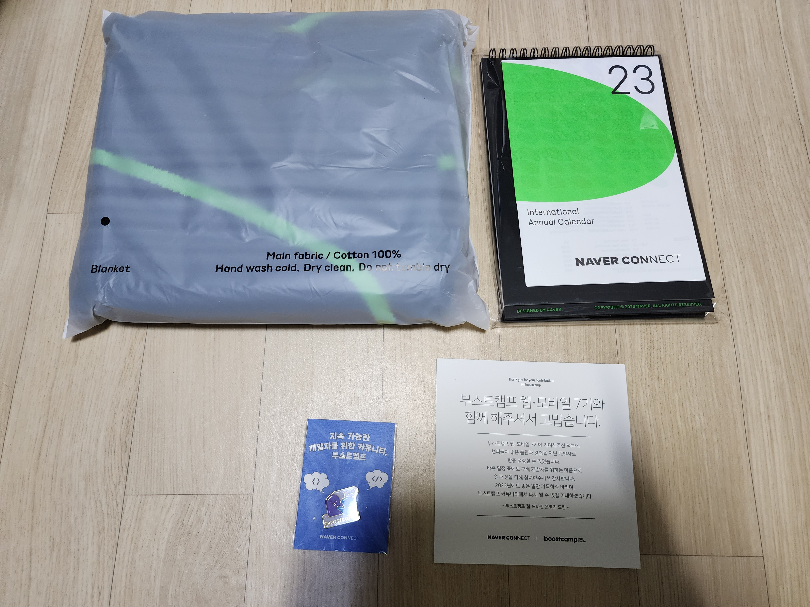
> 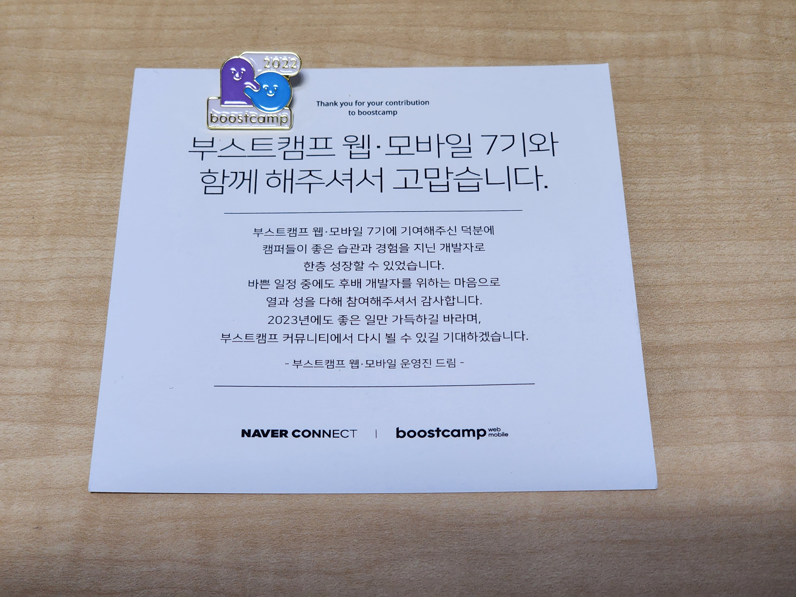

# 2023년 계묘년 나의 다짐
우선 작년도에 재대로 이행하지 못했던 부분을 마무리해보는 것이 중요한 것 같습니다.

위 마인드를 다잡자는 생각으로, 군인들이 총기 정돈하듯이 개발자는 키보드 정돈 해봐야하지 않을까 생각을 하게 되었고(~~사실 친구가 키보드 청소좀 하라고 한게 3달 전부터 이야기하던건 안비밀~~) 키보드 청소를 진행했습니다.
> 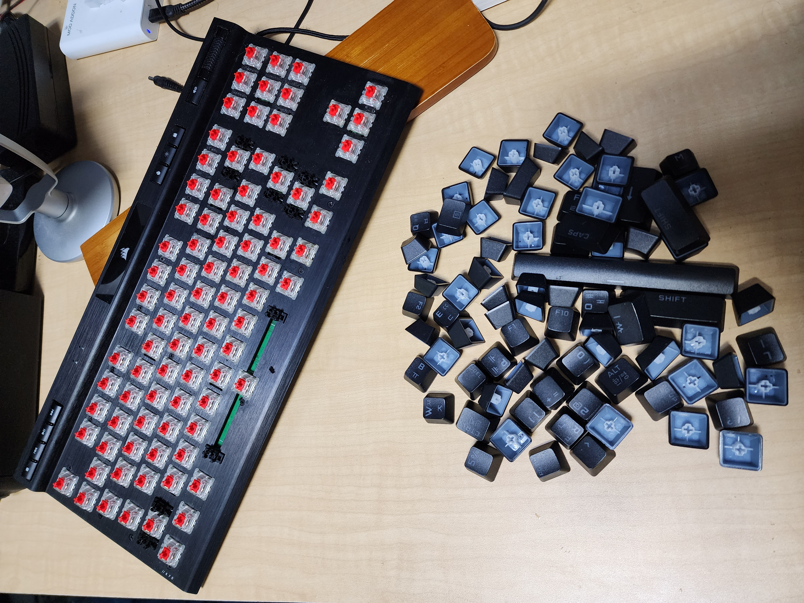
> 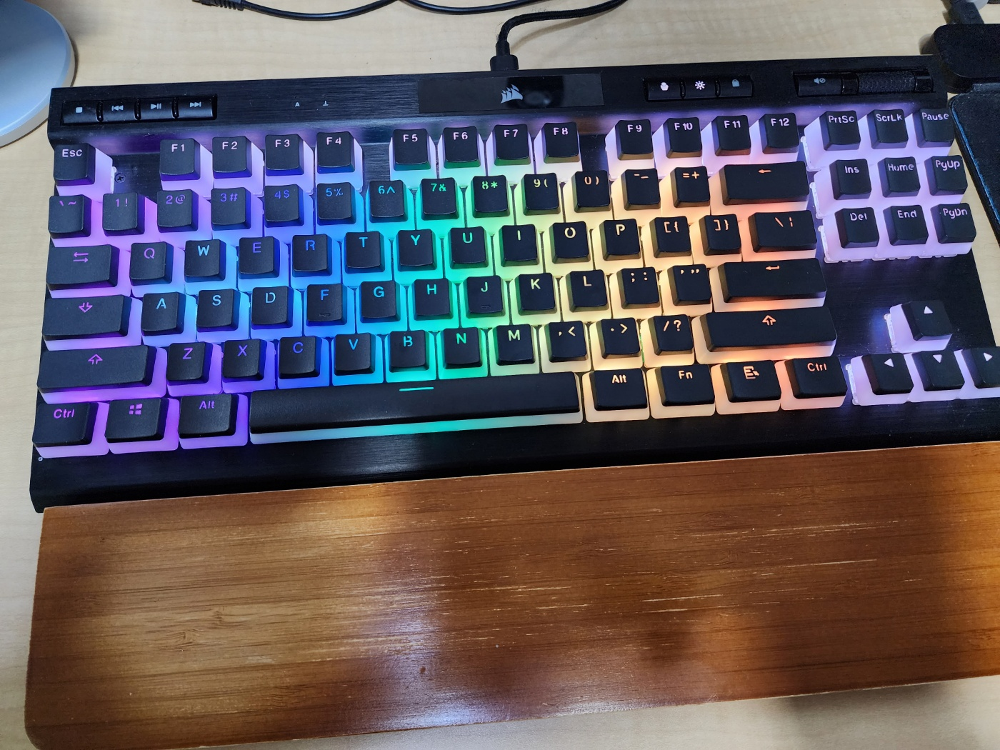
> "영롱 그자체"

## 우선 기본 플랜
- 작년에도 재대로 이루어지지 못했던 주3회 이상 헬스장 다니기
  - 안그러면 가뜩이나 컴퓨터 앞에서 생활하는데 거북목과 함께 시한부 디스크로 살아야 할지 모른다 ...
- 개발 외에도 발전적인 것 찾아서 하기
  - 아마도 개발은 스스로 찾아서 하니까 (과연...)
- 꾸준히 즐길 수 있는 취미 찾기
  - 이제 대학도 졸업하기에 더 많은 시간이 생기기 때문이다
- 청소 잘하기
  - 공간이 깔끔해야 다른 업무도 정돈해서 할 수 있으니까!
- 독서 진행하기
  - 리뷰를 함에 있어서 텍스트를 통한 전달이 미흡한 경우도 있었고 이제 나 혼자 보는 글이 아닌 여러명이 보는 블로그를 작성해야 되기 때문이다.
- 매달 공부한 내용에 대해서는 블로그 작성하기
  - 이왕 만든 블로그는 잘 활용해봐야지! (백엔드 개발자가 언제 다시 리액트를 써먹을 수 있겠어...)
- 오프라인 해커톤에서의 수상 한번 해보기!
  - 점점 해커톤도 많이 열리는 것 같은데, 지난번 코코톤에서의 아쉬음을 만회 해보자

이부분은 확실하게 말할 수 있을것 같은데, 2022년도에 구르듯 나를 2023년도에도 구르라고 하기는 어려울 것 같다.

대신에 내가 하는 일에 대한 가치를 찾아갈 수 있는 시기로서 생각하고 성장에 대한 방향성을 잡아보려고 합니다.

긴 글이기도 하고 재미없게 작성한 글이지만 끝까지 읽어주셔서 감사합니다.