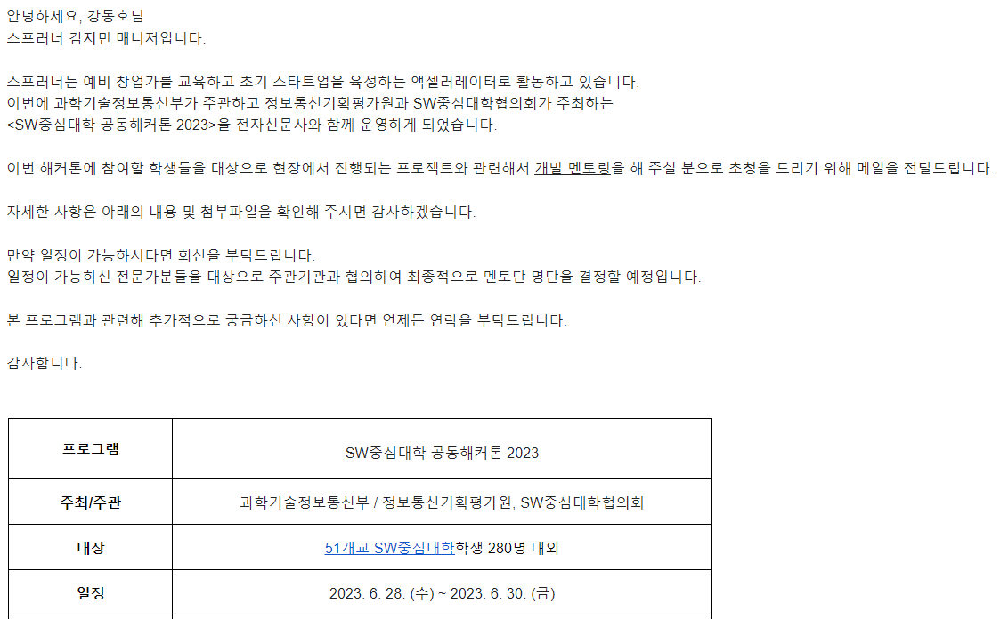
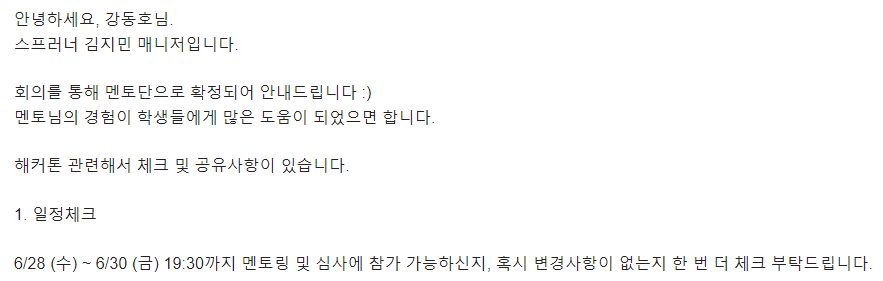
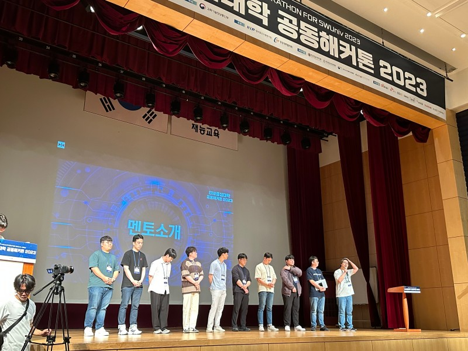
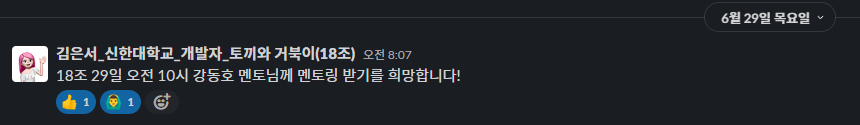
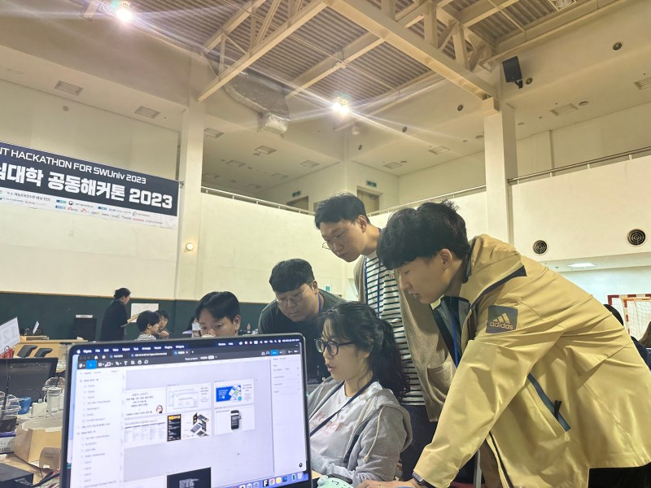

## 참여 동기
올해 2개의 해커톤인 ([코코톤](https://ivy-periodical-1dc.notion.site/8f571e47478346739e53a60a3d9735fb), [SPARCS 2023](https://festa.io/events/3006))에 참여하면서 해커톤 분위기를 즐길 수 있었는데 마침 딱 2월에 졸업을 하게 되어 [SW중심대학 해커톤 2023](https://www.swuniv.kr/56/?q=YToxOntzOjEyOiJrZXl3b3JkX3R5cGUiO3M6MzoiYWxsIjt9&bmode=view&idx=15247030&t=board)에는 참여할 수 없게 되었는데 😭  
그런 슬픔도 잠시 스프러너에서 해커톤 멘토링 요청 메일을 받게 되었고 해커톤 분위기를 다시 한번 느껴볼 수 있겠구나 라는 생각을 하면서 답장을 보냈습니다

이전 2017년도에 동일한 해커톤에 개발자로 참여했었고 개발적인 부분 뿐만 아니라 협업 관점에서 여러가지를 배워갔던 좋은 추억을 가지고 있어서 저에겐 더욱 애증이 되는 해커톤이였습니다

이전에 참여했던 경험을 어필하고 그동안의 이력을 상세히 기입해서 전달드린 이후, 다행히 멘토진으로 확정되었습니다  
백엔드 개발 뿐만 아니라 안드로이드나 프론트엔드 실무 경험이 있던 부분이 멘토링 하는 입장에서 조금은 ~~가점 요소~~🤔가 되지 않았을까 생각이 들더라구요😄

## 해커톤 1일차
사실 해커톤 당일에 기대가 되었던 나머지 잠이 너무 오지 않아 새벽 4시까지 눈만 뜬 상태로 침대에 누워있었는데 천안에 있는 재능교육연수원까지 가야하다 보니 억지로 누웠다 일어났다를 반복하다가 오전에 출발했다 ~~(사고 안나서 다행 ㅠ)~~

도착하고 보니 여러 멘토님들과 이야기를 나눌 수 있었는데 다른 멘토분들의 커리어를 이미 확인해서 알고 있었음에도 거물분들을 보는 느낌이였습니다

실제 이야기 해본 이후에 알게 된 사실은 **C레벨(CEO나 CTO 등) 직함을 달고 계신 분들이 비슷한 나이대에 계신 분이라는 점**이였다 (갓생 사시는 분들만 모아둔 느낌)

이후 체육관으로 이동하여 해커톤을 시작하게 되었고, 팀 빌딩때에는 기술스택에 맞는 멤버를 데려오기 위해 어필하는 모습을 볼 수 있었습니다

첫날엔 주로 아이디어 고도화나 프로젝트 셋업 위주로 진행되다 보니 많은 질문은 없었지만 같은 학교 후배분께서 아는척도 해주시고 각 팀의 아이디어가 궁금해서 돌아다녀 보니 시간이 훅훅 지나갔다

## 해커톤 2일차

오전부터 드디어 내 멘토링 스레드에 개발 질문이 달리기 시작!

각 팀마다 방문하면서 어떤 작업을 하다가 문제가 생긴건지 물어보고 해결 방안과 대체 방안을 제시하고 선택은 학생들이 할 수 있도록 진행했다.  
그러면서 알게 된 것은 다시 자리로 돌아갈 때마다 다른 팀에서도 서포트를 요청주셨고 백엔드를 보러 갔다가 프론트엔드를 작업하고, 안드로이드 개발도 질문받을 수 있었다.  
우리가 앉아있으면 조금은 물어보기가 힘들수도 있겠다 생각이 들었고 시간이 날 때마다 지속적으로 각 팀의 테이블을 돌아다니면서 멘토링을 계속해 나갔다.

사실 내 기술스택이 아닌 파이썬 Django 질문도 가끔 있었고 Flutter도 있었는데 최대한 아는 범위 내에서 로직을 적용해보았고, 다행히도 음성 업로드 로직 같은부분은 타 프레임워크에서 세팅하는 방법과 비슷해서 실제로도 문제를 해결할 수 있었다 ㅎㅎ

그러면서 점차 시간이 무르 익어갈때 즈음 부터는 다음날 점심 이전에 제출 마감이다 보니 시간이 점점 촉박해짐을 느꼈었는데 이때부터 핵심 로직들에 대한 문의가 많아졌다  

그러던 중 2일차 자정이 넘어가면서 각 팀의 완성도들이 무르익어가는 걸 볼 수 있었는데, 늦게까지 남아계신 멘토님들과 함께 여러 테이블을 돌아다니면서 각 서비스들에 대한 설명과 시연을 보러 다니면서 실제로 Production 레벨 수준의 팀들도 여럿 볼 수 있었고 더해질만한 아이디어나 기술적으로 필요한 부분을 추가적으로 짚어줄 수 있었다.

### 지금 와서 다시 생각해 본다면

시간적으로 포기해야할 요소와 핵심 기능으로 가져갈 부분들을 먼저 짚어주기 보다는 처음 해커톤에 참여하신 분들도 계셨는데 스스로 시간을 분배해서 진행할 수 있는 부분을 배려하지 못했나 생각도 들더라 

대신 **해커톤에 적용하고 싶었던 부분을 TodoList 같은 형태로 기록해두고 난 뒤, 집에 돌아가서 구현을 다시 해보시면 충분히 얻어갈 수 있는 부분**이라고 생각된다 (엔지니어링 요소는 사실 이때가 진짜인 것 같다)

## 해커톤 3일차

막상 자려고 보니 내 시계는 **오전 6시🕕**를 가리키고 있었다 (체크아웃은 **오전 10시🕙** ~ 😂😂)  
(~~지금 자러 가도 잠을 재대로 자기는 글렀다~~)

그래도 다음날인 토요일 오전에 출발하는 일정으로 잡아서 마지막까지 내가 도울 수 있는 팀들은 최대한 서포트 했는데, 특이한 기술스택을 사용한 팀이였던 **PINK PANDA**에서 시계열 차트를 그리는 작업과 발표자료를 3자 입장에서 리뷰할 수 있었는데 제출은 조금 늦었지만 수상까지 오를 수 있어서 몸은 피곤하지만 머릿속은 기분이 좋았다

사실 여러 해커톤을 참여하면서 느낀 점은, 좋은 아이디어나 엔지니어링 실력도 중요하지만 좋은 사람들과 웃으면서 개발할 수 있는 팀이 최종적으로는 성공하는 것 같더라...

실제로도 **팀 빌딩 과정에서 마지막 그리고 2시간이나 늦어진 팀**도 있었는데, 최종 발표 당시에 그 팀을 전담으로 맡아주신 멘토님께 살짝 여쭤봤더니 서로 열심히 하는 멤버들이 모여서 방향성 정도만 제시한 이후부터는 스스로 JAM 스택에 AI 로직까지 더해서 완성한 결과물을 최종 발표에서 볼 수 있었습니다

**좋은 멘토와 끈끈한 팀합이 있다면 좋은 결과로 이어지는 것**을 보면서 저 또한 많은 것을 배울 수 있었습니다

시상식 이후 버스 시간 때문에 많은 멘티분들과 이야기를 나누지 못했던게 너무 아쉬웠고 그래도 남아주신 멘티분들과는 몇가지 재미(~~🍻🍗~~)를 추가해서 진솔한 이야기를 나눌 수 있었습니다

모든 멤버가 열심히 해커톤에 임해주셨고 사건 사고 없이 잘 마무리 될 수 있어서 감사하다는 말씀 드리고 싶습니다 🙇

### 앗 그리고 몇가지 현지 맛집 추천드리면...
점심때 병천순대거리 방문해서 [사람이 좀 빈 순대국집](https://naver.me/FArQzIcD)으로 갔음에도 굉장히 맛있는 순대국을 먹을 수 있었다 (+ 깍두기와 배추김치가 맛있는건 덤)

저녁에는 [순두부집](https://naver.me/5tjiX0UP)에 가서 피곤한 상태임에도 굉장히 맛있는 음식인 두부정식과 제육볶음을 행복하게 먹을 수 있었습니다

역시 멀리 오면 **현지 맛집에 들려야 재대로 즐기는 것 같다 😋** 

## 집으로 ~ 🏠

마지막까지 남은 멘토분들과 함께 출발하면서 서로 못다한 이야기를 나누면서 출발할 수 있었습니다

행사를 기획해주신 조동인 대표님께 마지막으로 인사드리고 집으로 출발했습니다.
운전이 사알짝 서툴러서 다른 멘토님과 졸음쉼터에서 1~2시간 가량 더 자고 올라갔지만, 덕분에 안전하게 집에 도착할 수 있었습니다

같이 이동했던 동갑이신 멘토님의 추천으로 [쭈꾸미 맛집](https://naver.me/xIh2dSIQ)을 얻어먹을 수 있었는데 메인디쉬부터 디저트 그리고 음료까지 너무 행복하게 먹으면서 힐링할 수 있었습니다 👍 (다시 그 동네에 방문하게 된다면 꼭 들려야지!)
