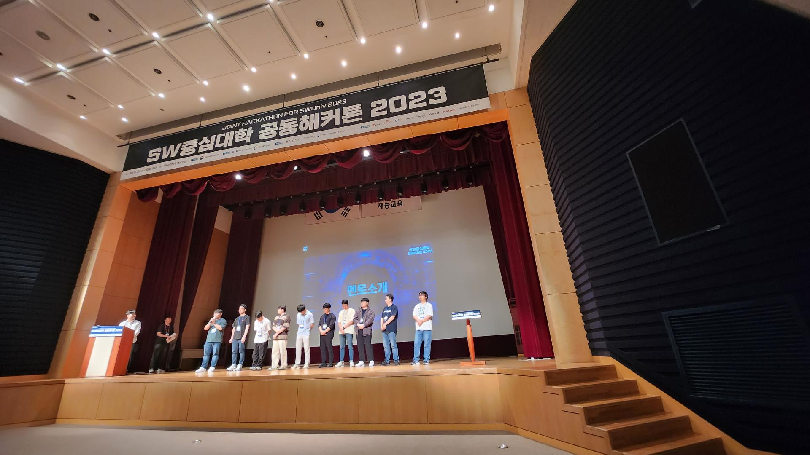

## 참여 동기
올해 2개의 해커톤인 ([코코톤](https://ivy-periodical-1dc.notion.site/8f571e47478346739e53a60a3d9735fb), [SPARCS 2023](https://festa.io/events/3006))에 참여하면서 해커톤 분위기를 즐길 수 있었는데 마침 딱 2월에 졸업을 하게 되어 SW중심대학 해커톤에는 참여할 수 없게 되었다 😭  
그런 슬픔도 잠시 스프러너에서 해커톤 멘토링 요청 메일을 받게 되었고 해커톤 분위기를 다시 한번 느껴볼 수 있겠구나 라는 생각을 하면서 답장을 보내게 되었습니다.

이전 2017년도에 동일한 해커톤에 개발자로 참여했었고 개발적인 부분 뿐만 아니라 협업 관점에서 여러가지를 배워갔던 좋은 추억을 가지고 있어서 저에겐 더욱 애증이 되는 해커톤이였습니다.

이전에 참여했던 경험을 어필하고 그동안의 이력을 상세히 기입해서 전달드린 이후, 다행히 멘토진으로 확정되었습니다.  
백엔드 개발 뿐만 아니라 안드로이드나 프론트엔드 실무 경험이 있던 부분이 멘토링 하는 입장에서 조금은 ~~플러스 요소~~🤔가 되지 않았을까 생각이 들더라구요 ㅎㅎ

## 해커톤 1일차
사실 해커톤 당일에 기대가 되었던 나머지 잠이 너무 오지 않아 새벽 4시까지 눈만 뜬 상태로 침대에 누워있었는데 천안에 있는 재능교육연수원까지 가야하다 보니 억지로 누웠다 깼다를 반복하다가 오전에 출발했다 ~~(사고 안나서 다행 ㅠ)~~

도착하고 보니 여러 멘토님들과 이야기를 나눌 수 있었는데 다른 멘토분들의 커리어를 알고 있었음에도 거물분들을 보는 느낌이였습니다

실제 이야기 해본 이후에 알게 된 사실은... 비슷한 나이대 였다는 것이다 (진짜 갓생 사시는 분들만 모아둔 느낌)

이후 체육관으로 이동하여 해커톤을 시작하게 되었고, 팀 빌딩때에는 기술스택에 맞는 멤버를 데려오기 위해 어필하는 모습을 볼 수 있었습니다

그리고

## 해커톤 2일차

드디어 내 멘토링 스레드에 개발 질문이 달리기 시작!

각 팀마다 방문하면서 어떤 문제인지 파악할 수 있었고

프론트엔드나 백엔드 뿐만 아니라 유일하게 담당했던 안드로이드 까지 멘토링하면서 시간을 보낼 수 있었습니다 (백엔드나 프론트엔드는 다른 분들도 많이 알고계셔서 안드로이드 멘토링 할 떄 더 뿌듯)

### 지금 와서 다시 생각해 본다면

시간적으로 포기하는 요소를 이야기 해주기 보다는 개발자로서 엔지니어링 요소에 도전해보라고 했어야 하나 생각도 들었다.  
물론 상을 위해서는 필연적인 선택이다 보니 해커톤에 적용하고 싶었던 부분을 집에 돌아가서 다시 만들어 보라고 이야기해드렸고
다시 만들어보면서 얻어갈 수 있는 부분이라고 생각된다 ㅎㅎ

## 해커톤 3일차

해커톤은 좋은 아이디어도 좋지만

좋은 사람들과 웃으면서 개발할 수 있는 팀이 최종적으로는 성공하는 것 같다

버스 시간 때문에 여러 멘티분들과 이야기를 나누지 못했던게 너무 아쉬웠습니다

네트워킹 파티때에 재미를 위한 세팅까지 ㅎㅎ

## 집으로 ~ 🏠

너무 피곤한 나머지 숙박 이후에 출발했는데

덕분에 끝까지 남아서 조동인 대표님 멘토님들 그리고 남아주신 학생분들과 진솔한 이야기를 들을 수 있어서 행복했습니다

운전이 사알짝 서툴러서 중간에 한숨 더 자고 올라갔지만, 덕분에 안전하게 집에 도착할 수 있었습니다
