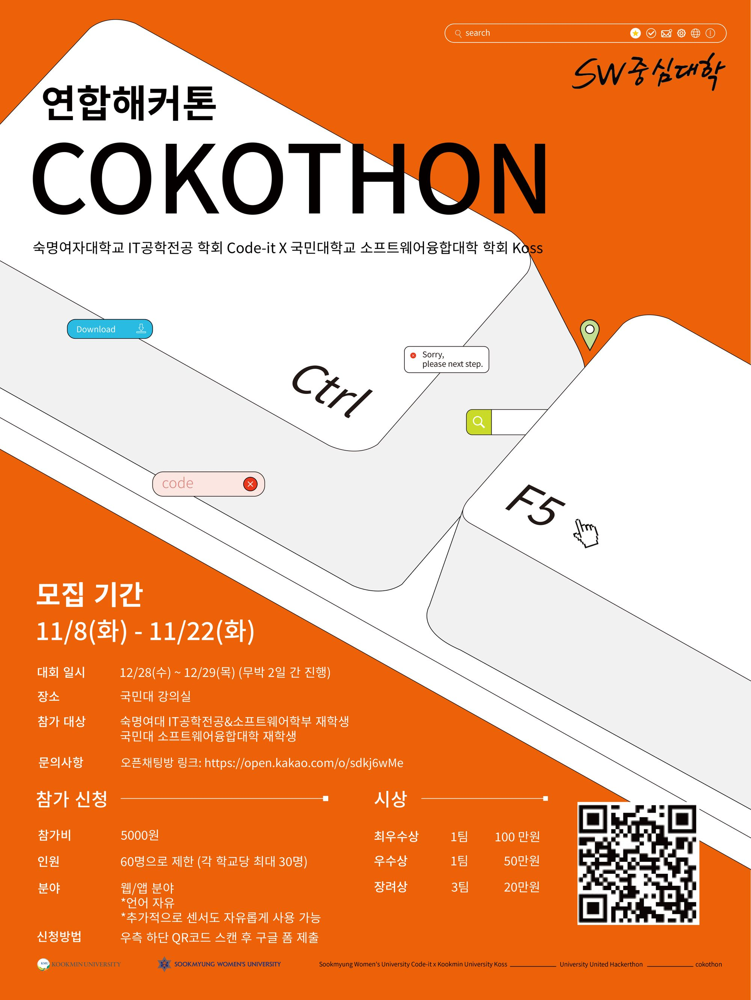
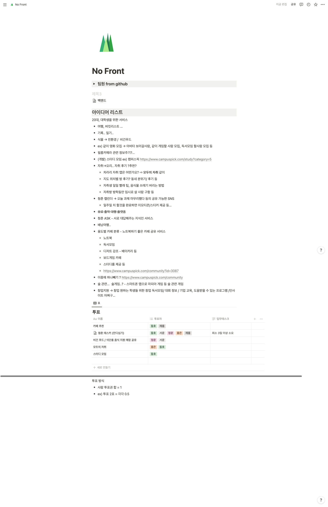
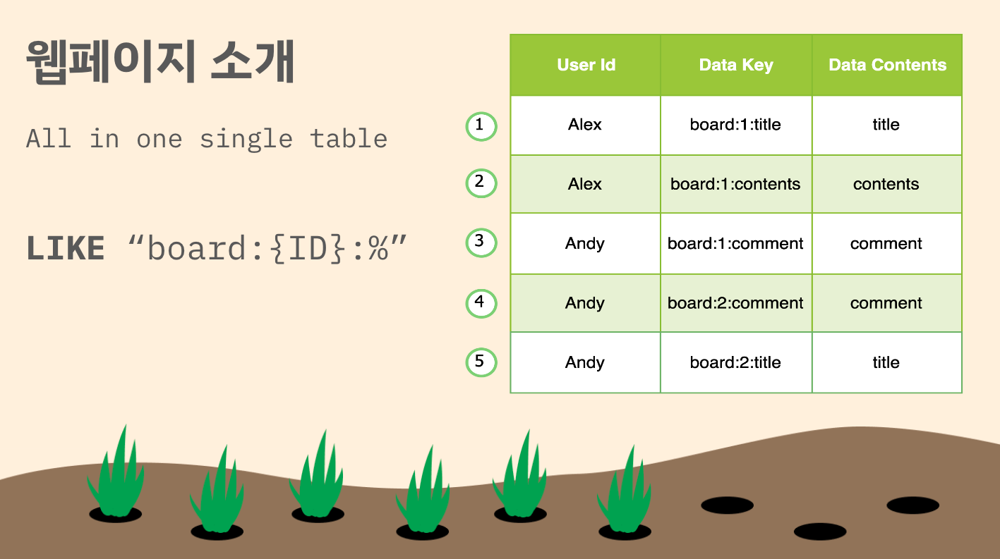
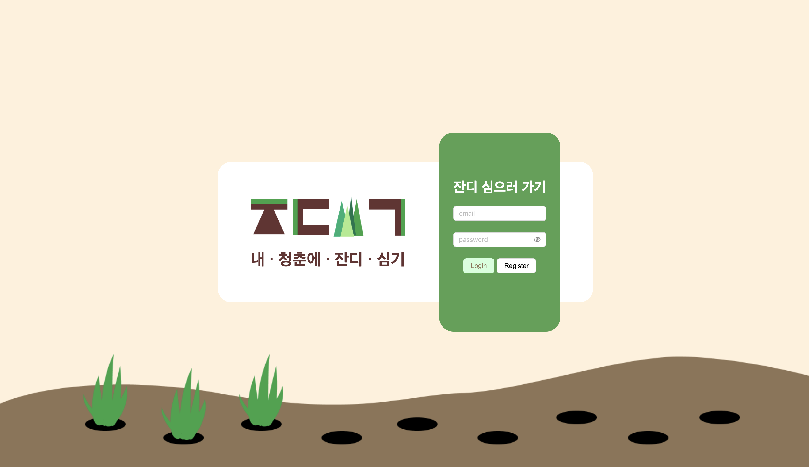
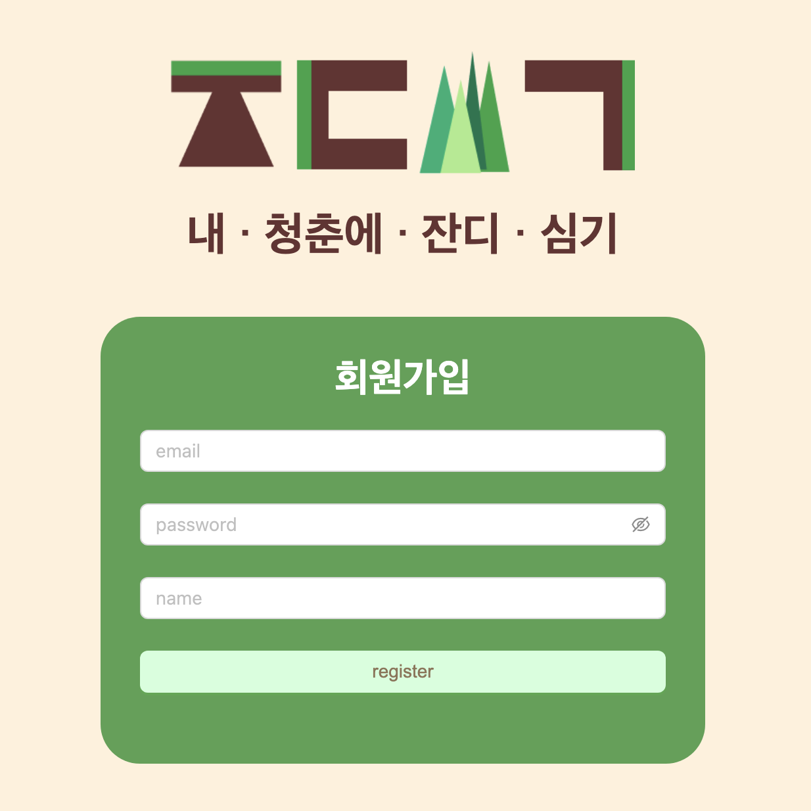
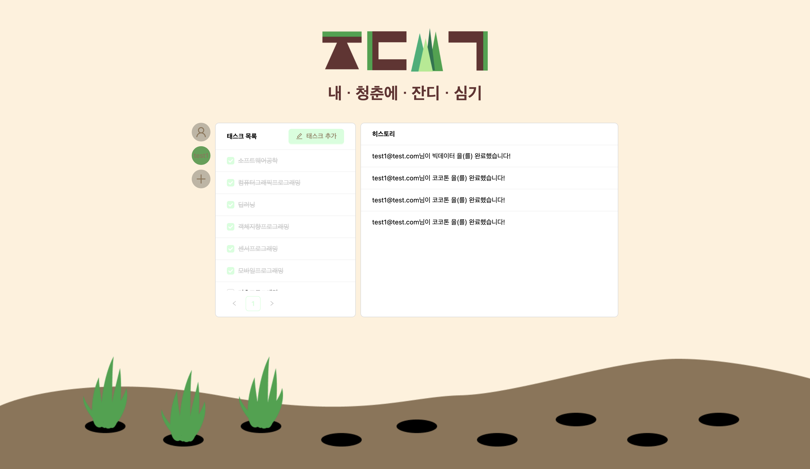
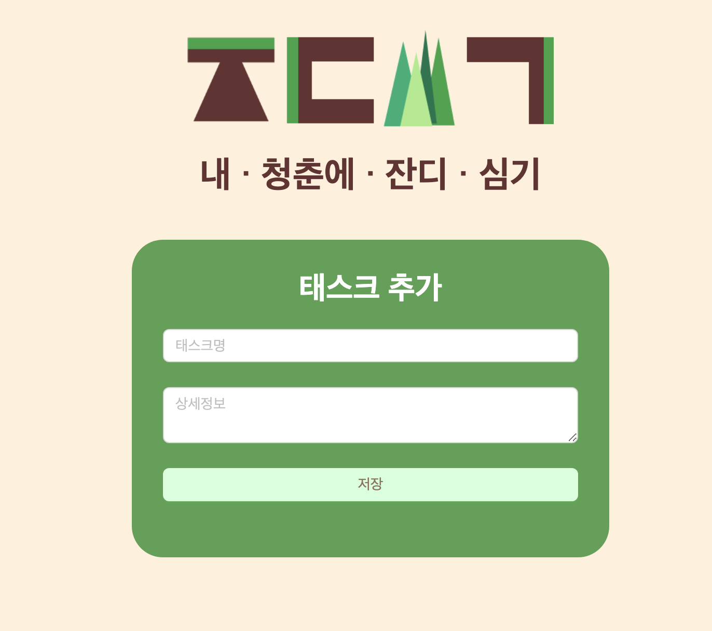
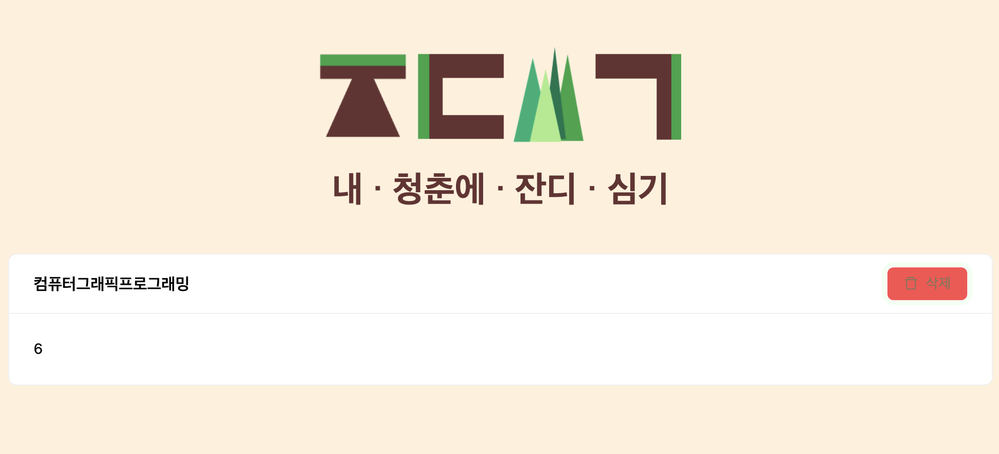
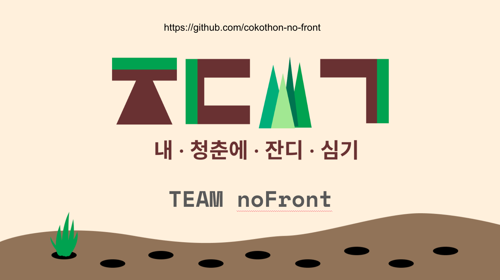

## 참여 동기
코로나로 인한 거리두기도 끝나가는데 이번엔 꼭 오프라인 해커톤을 나가봐야겠다.
그나마 최근에 참여한 해커톤도 2020년이였고 **온라인** 해커톤이였다 😢

그래서 아직 학생이라는 본분에 걸맞게 학교에서 소프트웨어융합대학 학생들을 대상으로 해커톤을 개최한다더라
> [코코톤 공고 링크](https://ivy-periodical-1dc.notion.site/8f571e47478346739e53a60a3d9735fb)
> 

보자마자 와 이번엔 꼭 오프라인으로 참가해서 ~~상까지 받아오자~~는 생각이 있었습니다. 그만큼 저에게는 오프라인 해커톤에서의 성과는 항상 제로였었고 그동안 제가 쌓아온 실력들을 발휘해볼 수 있는 기회가 되지 않을까 생각했습니다

그래서 현 포지션인 백엔드 뿐만 아니라 프론트엔드와 안드로이드 또한 중 정도로 기입하면서 어떤 포지션에서도 서비스를 만든다는 목적에 다가가기 위해 다짐하며 참가를 완료할 수 있었습니다.

## 대회 당일
팀은 이전에 미리 구성해오는 것이 아닌 당일 점심부터 배정되는 방식이였습니다.
명찰에 내 팀의 번호가 있었고 1팀이라서 그런지 맨 앞자리에 위치하고 있었습니다.
제가 딱 시간을 맞춰서 도착하다 보니 가장 마지막에 도착했어서 모든 팀원들께 인사드리고 이후 팀명선정, 아이스브레이킹 등을 통해 서로간에 기술스택이나 자신있는 파트등에 공유할 수 있었다.

한가지 아쉬웠던 점이 있다면, 무슨 사다리타기를 이름 막 넣고 돌렸다고 하는데 내가 ~~하필~~ 팀장이라고...
그리고 팀명은 전부 백엔드 개발자만 모여서 noFront라고 정했다 🤪 ~~우리는 반드시 해낼 것이다 늘 그랬듯이~~

그래서 우리는 바로 주제를 탐색해서 들어갔고 주제는 "청춘"이라는 것이였고, 곧바로 브레인스토밍에 들어갔다
> 
> 이것이 바로 우리의 아이디어 과정과 최종 투표!

우리의 아이디어는 청춘들이 해야할 일을 정하고 서로간의 동기부여를 받을 수 있는 태스크 관리 서비스를 만들고자 정했고 서비스 이름은 무려 잔디심기~~깃허브 일일 커밋에서 따왔다는건 함정~~로 정했다

## 개발 과정
프론트 없는 개발팀에서 서비스를 완성하기 위해서는 부족한 프론트 개발 능력을 조금이라도 살려서 서비스의 기본을 탄탄하게 만들어 보자는 것을 목표로 두었다!

그래서 필요한 페이지 정보들은 아래와 같았다
- 계정 (로그인 / 회원가입)
- 태스크 목록 / 히스토리 / 친구 관리
- 태스크 상세 추가 및 삭제

백엔드는 별도로 Single Table System 을 구축해서 사용하였고, 프론트엔드는 그 테이블에 키 조합으로 추가하고 가져오는 API를 구성하여 작업했다.
관련해서 팀원분들이 만들어주신 PPT가 좋은 설명이 될것 같아서 첨부해보면
> 
> 특정 기능을 만들 떄마다 테이블을 추가하는 것이 아닌 DataKey를 베이스로 추가하는 것이다
> 이때, 내용이나 댓글은 고유한 primary_key 하위에 들어가기 떄문에 "board:1:%"와 같이 mysql like 구문으로 조회하면 필요한 내용을 쿼리해서 가져올 수 있는 방식인거죠

위 방식을 바탕으로 저희 팀은 프론트에 조금 더 많은 시간을 투자할 수 있었고, 서윤님이 만들어주신 디자인을 최대한 반영할 수 있는 상황을 만들었습니다.
최종적으로는 아래와 같은 화면 구성을 가진 서비스를 만들 수 있었습니다.
> 
> 
> 
> 
> 

이떄만 하더라도 진짜 잘만들었다고 생각했고, 머릿속에 드는 생각은 빨리 잘 수 있으면 좋겠다는 마인드 뿐이였다
이런 안일한 생각을 가지고... 다른 팀들은 실제 제출시간 30분이 남았더라도 계속해서 완성도를 높이고 있었다

## 발표
그렇게 최종적으로 발표하는 시간이 있었고 우리 팀원 두분이 앞에서 발표를 진행해 주셨다

사실 계속 떨린다고 말씀하셨는데도 불구하고, 앞에서 엄청 자연스럽게 설명하시는 모습을 보고 너무 존경심이 생겼다! => ~~이때까지만 해도 난 분명히 상을 받겠지 라는 생각을 하고 있었다~~
그런데 다들 생각보다 아이디어들이 참신했고, 서비스의 사이즈가 발표시간 직전까지 열심히 개발해나가야 할만큼 많은 양이라는 것 또한 알게 되었다
남은 시간에 최대한 와이어프레임 구성에 맞도록 더 레이아웃을 깔끔하게 하고, 팀의 아이디어 방향성을 더 깔끔하게 정리했으면 최소한 장려상까지는 받지 않았을까 생각하는데 ㅠㅠ
그동안 평소에 하던 업무와는 다르게 기획도 개발자가 디자인도 개발자가, 사용자 편의성 또한 개발자가 하다 보니 중요한 부분에 대해 조금은 신경을 덜쓰지 않았던것 같다

후.. 나한테 이제는 더이상 이런 해커톤 기회가 있을까? 사실 이번 해커톤이 내 대학생활의 라스트 댄스라고 생각했다.

그리고 숙명여대 교수님께서 말씀해 주신 *남도 쓰고싶은 서비스*를 만들어야 한다는 라는 말이 크게 다가왔던 것 같다

막상 우리가 만든 서비스는 사실 통신이 되고 계정별로 저장이 되는 To Do List의 연장판인 것 같더라

대회라는 곳은 서로가 모두 동일한 시간을 가지고 최대한 좋은 결과물을 낼 수 있는것이 목표인 만큼, **안일한 마음을 가진 나머지 중요한 것을 캐치못하는 상황이 발생하면 안되겠다**는 생각이 이번 대회를 통해 얻게 되었다.

~~물론 내가 현업 개발자라는 생각도 이런 부분에 더 크게 작용했을것 같기도 하지만서도~~

## 산출물
- [깃허브](https://github.com/cokothon-no-front)
- [아이디어 노트](https://www.notion.so/donghodev/No-Front-f7a60b1977624e08b5fcd12774e84437)
- [발표자료](https://docs.google.com/presentation/d/11uGcmm_m9dsUCHV9_mTS6DZh9UIaBzH-p-UtenMRack/edit?usp=sharing)